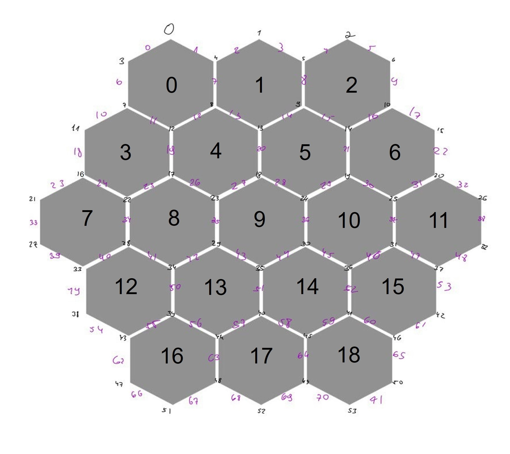

## Author
- Bar Yechezkel
- Email: baryechezkel@gmail.com

# Catan Game Project

This project is an implementation of the popular board game Catan using C++.

## Table of Contents

- [Introduction](#introduction)
- [Getting Started](#getting-started)
- [Usage](#usage)
- [Classes Overview](#classes-overview)

## Introduction

The Catan game project is a C++ implementation of the Settlers of Catan board game. The game involves players building settlements, roads, and cities to gather resources and gain victory points. The player with the most victory points at the end of the game wins.

## Getting Started

### Prerequisites

Ensure you have a C++ compiler (like g++ or clang++) installed on your system.

### Building the Project

1. Clone the repository:
    ```bash
    git clone https://github.com/your-username/catan-game.git
    cd catan-game
    ```

2. Compile the project:
    ```bash
    g++ -o catan main.cpp Catan.cpp Player.cpp Board.cpp DevCard.cpp Knight.cpp VictoryPoint.cpp RoadBuilding.cpp YearOfPlenty.cpp Monopoly.cpp
    ```

3. Run the executable:
    ```bash
    ./catan
    ```

## Usage

To start the game, run the compiled executable. The game will initialize the players, board, and development cards, then proceed with the game turns. Follow the on-screen instructions to play according to the board picture.

- When you need to choose a place for a road, choose the pink number of the edge tile (0-71).
- When you need to place a settlement or city, choose the black number of the vertex tile (0-53).


## Classes Overview

### Catan

- Manages the overall game flow.
- Holds references to players, the board, and the development cards.

### Player

- Represents a player in the game.
- Manages player-specific data like resources, settlements, roads, and development cards.

### Board

- Represents the game board.
- Manages tiles, settlements, roads, and resource distribution.



### DevCard - Using Inheritance

- Base class for development cards.
- Derived classes: `Knight`, `VictoryPoint`, `RoadBuilding`, `YearOfPlenty`, and `Monopoly`.

### Tests

-The code was checked with many tests in Test.cpp with the make test command.


 
